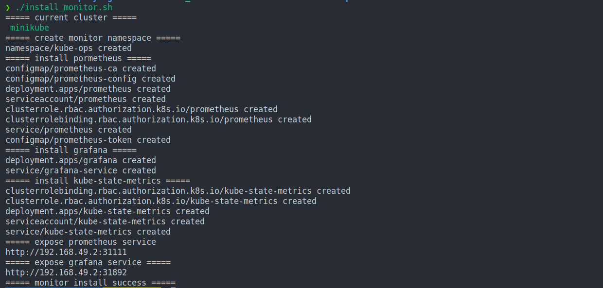
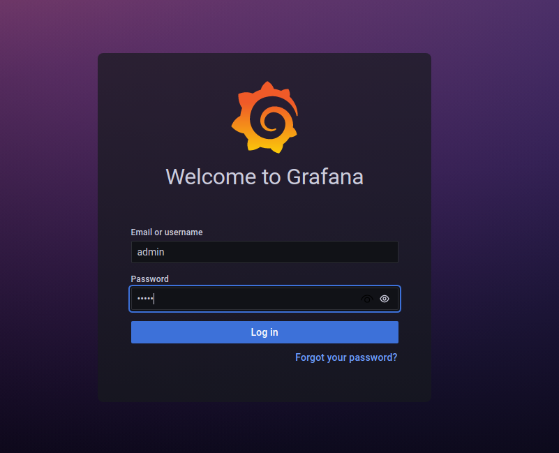
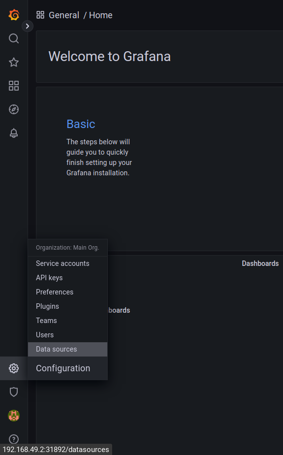
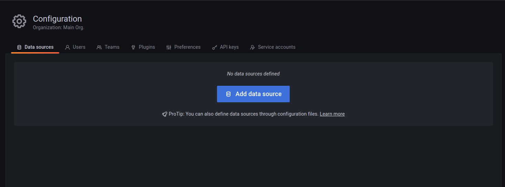
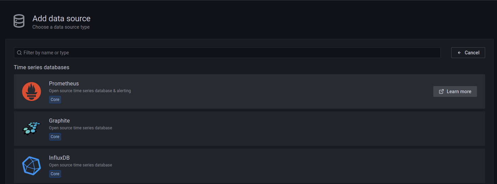
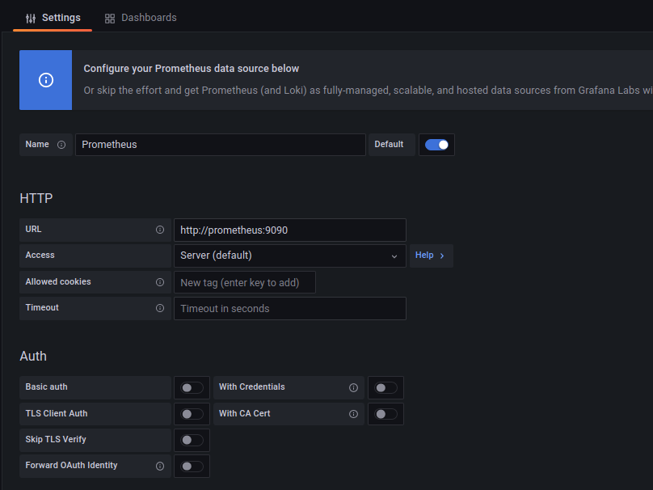
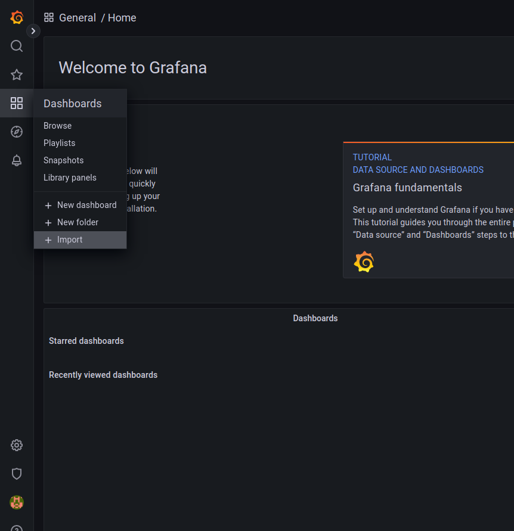
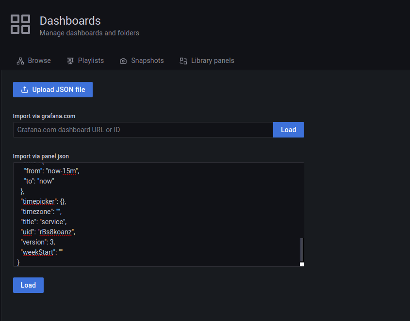
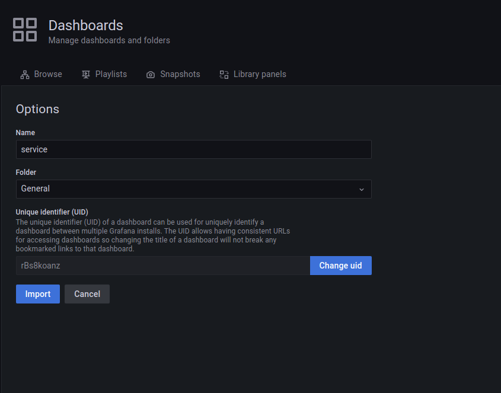
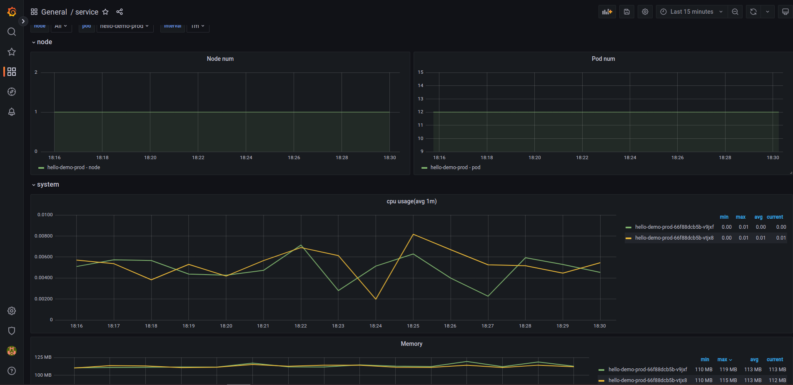

# k8s-monitor

## 介紹

在minikube環境下安裝prometheus以及grafana監控 k8s
- demo-deploy：測試用deployment 使用skaffold搭配kustomize的方式下去佈署
- prometheus, kube-state-metrics：撈取服務相關指標
- grafana：監控UI

## 使用方式

1. start minikube
```
minikube start 
```

2. deploy demo-deployment
```
cd demo-deploy && skaffold run -p prod 
```

3. install monitor
```
sh ./install_monitor.sh
```


4. setting data source

- 使用上面執行完的grafana url
```
http://192.168.x.x:xxx
```

- 輸入帳號密碼：admin


- 選擇data source -> add data source -> prometheus






- url設定為http://prometheus:9090 -> 點擊save


5. import grafana ui

- 點擊左上角回到首頁並選擇旁邊的dashboard -> import


- 到grafana/dashboard/複製dashboard.json貼到grafana並點擊load -> import 





## todo
- [ ] 使用壓測pod去測試hpa
- [ ] 使用prometheus-adapter自定義指標

